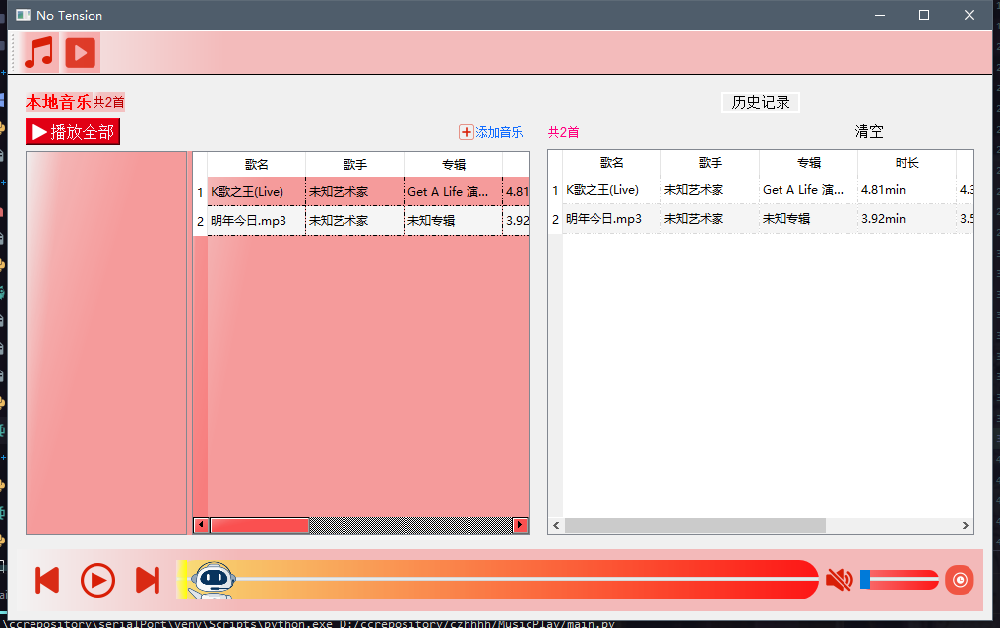

# yjc版本
## 可以下载main.exe玩半成品  注意 播放器的目录一定不要变!
## requirement
若是想视频解码成功得需要这个
- [https://files.1f0.de/lavf/LAVFilters-0.73.1.exe](https://files.1f0.de/lavf/LAVFilters-0.73.1.exe)

## Update

- 2020年11月26日23:00:42 
    - 更新进度条,可用
        - 使用musicMediaPlayer的信号durationChanged 以及 positionChanged搞定
    - 可以拖动音乐进度
        - 使用 `self.horizontalSlider.sliderMoved.connect(lambda :self.musicMediaPlayer.setPosition(self.horizontalSlider.value()))`实现
    - 实现了单曲循环,随机播放,列表循环等
        - 使用QMediaPlaylist实现

- 2020年11月26日20:29:55
    - 支持历史记录记载 绑定清空按钮
    - 调整了一下动效,好看了一点
- 2020年11月26日12:50:51 
    - 更新历史记录播放列表
    - 使用QSplitter支持控件调整大小

## TODO

- UI待优化
- 差歌词
- 上一首下一首按钮
- 音量键

